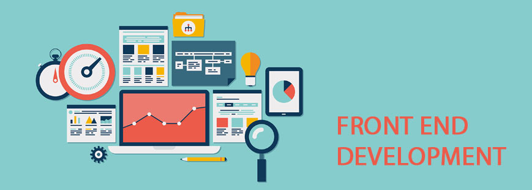

<!-- Название -->
<div align="center">
    
    <h1> MyProject by Frontend Development</h1>
</div>

<!-- Запуск -->
### Запуск  
Чтобы запустить проект необходимо в консоли ввести следующие команды:
```
npm clone https://github.com/OlhaKlymas/MyProject.git
npm install
npm run dev
```
<!-- Описание -->
### Описание  
MyProject - это проект, над которым проводилась работа на протяжении всего курса Frontend Advanced. В результате получилась админпанель, которую можно использовать для CMS (движка сайта). 
При его создании были использованы следующие технологии:
  

|   `Название`    |   `Версия`    |  
|---------------- |--------------:|  
|   **Webpack**   |   *3.11.0*    |  
|     **Vue**     |   *2.5.13*    |  
|     **SASS**    |   *6.0.6*     |  
|     **Pug**     |   *2.0.0-rc.4*|  

<!-- Архитектура -->
### Архитектура  

<canvas id="c1" width="400" height="200">

</canvas>
<style type="text/css">
	#c1{
		width: 400px;
		height: 200px;
		border: 3 px solid black;
	}
</style>

<a href="http://www.youtube.com/watch?feature=player_embedded&v=3fbUDHmNKo8" target="_blank"></a>